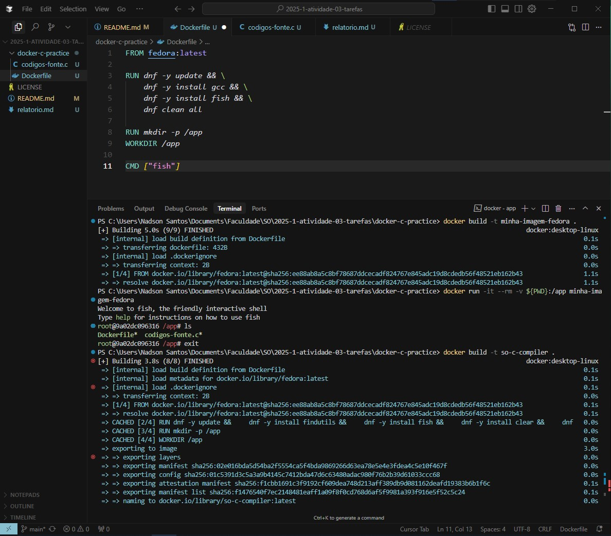
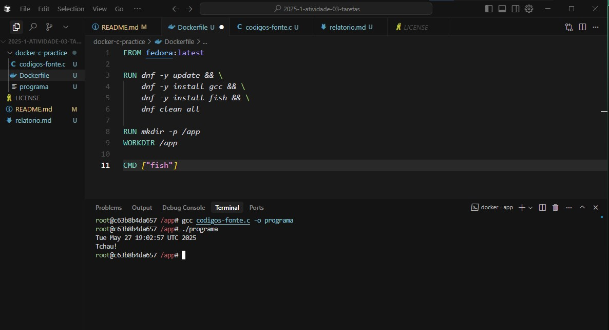

# S.O. 2025.1 - Atividade 03: Compilação de código dentro de Docker Fedora

Este repositório contém o relatório da **Atividade 03** da disciplina **Sistemas Operacionais (SO 2025.1)**, ministrada pelo Prof. Leonardo A. Minora, no IFRN - Campus Natal-Central.

---

## Informações Gerais

* **Objetivo do repositório**: Repositório para atividade avaliativa dos alunos
* **Assunto**: Implementação de tarefas (processos) em C
* **Público-alvo**: Alunos de SO do curso de TADS no CNAT-IFRN
* **Disciplina**: [Sistemas Operacionais](https://github.com/sistemas-operacionais/)
* **Professor**: [Leonardo A. Minora](https://github.com/leonardo-minora)
* **Aluno**: [Nadson Santos Nascimento](https://github.com/nadsuus)

---

## Sumário

1. [Tutorial Introdutório de Dockerfile](#tutorial-introdutorio-de-dockerfile)
2. [Prática](#parte-2-pratica)

   1. [Fork e identificação](#fork-e-identificacao)
   2. [Preparando o Ambiente](#preparando-o-ambiente)
   3. [Conteúdo do Dockerfile](#conteudo-do-dockerfile)
   4. [Construindo a Imagem Docker](#construindo-a-imagem-docker)
   5. [Executando o Container e Compilando C](#executando-o-container-e-compilando-c)
3. [Relatório da Prática](#parte-3-relatorio-da-pratica)

   1. [Objetivo](#objetivo)
   2. [Passos Executados](#passos-executados)
   3. [Resultados Obtidos](#resultados-obtidos)
   4. [Conclusão](#conclusao)

---

## Tutorial Introdutório de Dockerfile

Siga o tutorial fornecido no enunciado (parte 1) para criar um Dockerfile básico baseado em Fedora, que instala utilitários e define o shell `fish` como padrão.

> **Exemplo de Dockerfile**:
>
> ```dockerfile
> FROM fedora:latest
>
> RUN dnf -y update && \
>     dnf -y install gcc && \
>     dnf -y install fish && \
>     dnf clean all
>
> RUN mkdir -p /app
> WORKDIR /app
>
> CMD ["fish"]
> ```

---

## Parte 2. Prática

### Fork e identificação

1. Fork este repositório para sua conta.
2. Edite o campo **Aluno** no cabeçalho, substituindo por seu nome e link para GitHub.

### Preparando o Ambiente

1. Crie uma pasta local, ex: `docker-c-practice`.
2. Dentro dela, adicione:

   * O seu `Dockerfile` (conforme tutorial).
   * Os códigos-fonte em C do capítulo de implementação de tarefas (PDF do livro da disciplina).

### Conteúdo do Dockerfile

* Base: `fedora:latest`
* Instalação de `gcc` e `fish`
* Criação de `/app` e definição de `WORKDIR`
* Comando padrão: `fish`

### Construindo a Imagem Docker

No terminal (PowerShell ou CMD), execute:

```bash
docker build -t so-c-compiler .
```

> **Print A:** Saída do `docker build`
> 

### Executando o Container e Compilando C

1. Execute o container mapeando o diretório de código:

   ```bash
   ```

docker run -it --rm -v \${PWD}:/app so-c-compiler

````
2. Dentro do container, compile seu programa em C:
```fish
gcc -o programa tarefa.c
./programa
````

3. Registre a saída e eventuais erros.

> **Print B:** Compilação e execução
> 

---

## Parte 3. Relatório da Prática

**Nome:** Nadson Santos Nascimento
**Data:** 27/05/2025

### 1. Objetivo

Descrever o processo de criação de uma imagem Docker capaz de compilar e executar código em C, utilizando `gcc` em um container Fedora.

### 2. Passos Executados

* Fork do repositório e configuração inicial.
* Criação do `Dockerfile` com instalação de `gcc` e `fish`.
* Build da imagem com `docker build`.
* Execução do container com mapeamento de volume (`-v`).
* Compilação do código C dentro do container.

> **Comandos principais**:
>
> ```bash
> docker build -t so-c-compiler .
> docker run -it --rm -v ${PWD}:/app so-c-compiler
> gcc -o programa tarefa.c
> ./programa
> ```

### 3. Resultados Obtidos

* **Build**: imagem criada com sucesso.
* **Compilação**: código compilado sem erros.
* **Execução**: saída correta conforme esperado.

> **Print C:** Saída do programa
 

### 4. Conclusão

A prática permitiu entender como:

* Estruturar um **Dockerfile** para ambientes de compilação.
* Mapear volumes para desenvolvimento local.
* Utilizar `gcc` dentro de um container Fedora.

Esses conhecimentos podem ser aplicados em pipelines de CI/CD e ambientes de desenvolvimento isolados.

---
